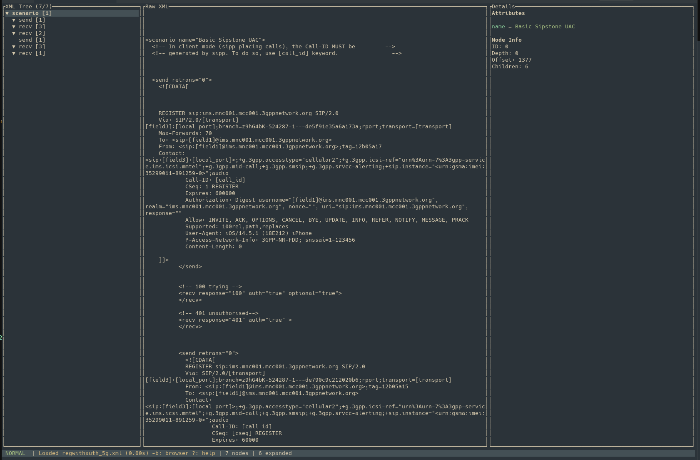

# xml-tui-viewer

A fast terminal-based XML viewer built with Rust and [ratatui](https://github.com/ratatui-org/ratatui).





## Features

- **File Browser** — navigate directories and open XML files without leaving the TUI; switch back at any time with `b`
- **Tree View** — hierarchical display of XML elements with expand/collapse
- **Three-pane layout**
  - Left: XML element tree
  - Center: raw XML of the selected node (with text wrap)
  - Right: attributes and node metadata
- **Search modes**
  - `/` — regex search
  - `f` — fuzzy search
  - `x` — XPath query
- **Full keyboard navigation** — vim-style (`j`/`k`/`h`/`l`), arrows, page, home/end
- **Performance** — memory-mapped I/O, file-offset indexing, visible-node caching

## Installation

```bash
cargo build --release
```

Binary will be at `target/release/xml-tui-viewer`.

## Usage

```bash
# Start the file browser (no argument)
./xml-tui-viewer

# Open a file directly
./xml-tui-viewer /path/to/file.xml
```

Press `b` from the viewer at any time to return to the file browser.

## Keybindings

### Navigation

| Key | Action |
|-----|--------|
| `j` / `↓` | Move down |
| `k` / `↑` | Move up |
| `h` / `←` | Collapse node / go to parent |
| `l` / `→` | Expand node |
| `Space` | Toggle expand/collapse |
| `PgDn` / `PgUp` | Page down / up |
| `Home` / `End` | Jump to first / last node |
| `g` | Jump to node by ID |
| `e` | Expand all |
| `c` | Collapse all |

### Search

| Key | Action |
|-----|--------|
| `/` | Regex search |
| `f` | Fuzzy search |
| `x` | XPath query |
| `n` / `p` | Next / previous result |
| `Esc` | Clear search / exit mode |

### General

| Key | Action |
|-----|--------|
| `b` | Back to file browser |
| `?` / `H` | Toggle help overlay |
| `q` | Quit |

### File Browser

| Key | Action |
|-----|--------|
| `j` / `↓` | Move down |
| `k` / `↑` | Move up |
| `l` / `→` / `Enter` | Open directory or file |
| `h` / `←` | Go to parent directory |
| `q` / `Esc` | Quit |

## XPath Examples

```xpath
/suite/test               # All test elements under suite
/suite/test[1]            # First test element
/suite/test[@name]        # Tests with a name attribute
/suite/test[@status="PASS"]  # Tests where status equals PASS
//kw                      # All kw elements anywhere in the document
```

## Dependencies

| Crate | Purpose |
|-------|---------|
| `ratatui` | TUI rendering |
| `crossterm` | Terminal backend |
| `quick-xml` | XML parsing |
| `memmap2` | Memory-mapped file I/O |
| `rayon` | Parallel processing |
| `fuzzy-matcher` | Fuzzy search |
| `anyhow` | Error handling |